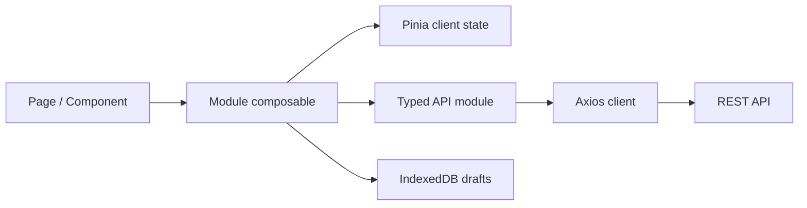
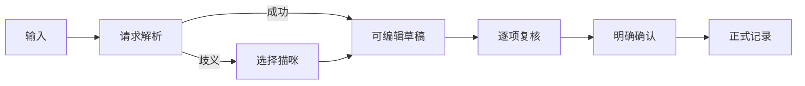

# 猫宅 MeowHome 前端开发方案

> 文档版本：v1.0  
> 编制日期：2026-08-06  
> 对应总方案：[MeowHome-开发方案.md](./MeowHome-开发方案.md)  
> 技术栈：Vue 3、TypeScript、Vite、Pinia、Vue Router、Vant 4、ECharts、Axios、vite-plugin-pwa

## 1. 前端目标

前端负责把多猫家庭的记录、查询、提醒、协作和 AI 辅助能力组织成适合长期高频使用的移动优先 PWA。首要目标是让用户始终明确“正在为哪只猫、在什么时间、记录什么事情”，并能快速检查和纠正结果。

前端必须保证：

1. 猫咪身份在录入、编辑、趋势、AI 草稿和附件确认中持续可见，禁止隐式沿用不明确对象。
2. AI 结果始终以草稿或摘要呈现，标明 AI 生成、证据、数据范围和缺失信息。
3. 离线、弱网、重复点击、登录失效及接口降级不会产生静默重复记录。
4. 375×812 和 390×844 尺寸下操作完整，桌面端也具有合理布局。
5. 基础记录不依赖 AI；AI/OCR 不可用时仍可手工完成工作。

## 2. 职责边界

### 2.1 前端负责

- 页面信息架构、导航、交互流程、表单校验和状态反馈。
- 当前家庭和当前猫咪上下文的清晰展示与安全切换。
- 调用 REST API、消费 OpenAPI 类型、统一处理业务错误和请求 ID。
- 本地未提交草稿、PWA 壳层、安装体验和离线状态提示。
- AI/OCR 草稿的展示、编辑、未确定字段处理和显式确认。
- 图表可视化、数据缺失表达、证据跳转及医疗免责声明。
- 上传前提示、进度、取消、失败恢复和预览。
- 关键逻辑、组件、页面集成和端到端测试。

### 2.2 前端不负责

- family 权限的最终判定、健康统计值计算、风险等级决策。
- AI Prompt、模型密钥、JSON Schema 最终校验或直接调用模型服务。
- 提醒实例生成、库存最终数量、用药幂等和跨对象事务。
- 将浏览器缓存当作正式健康数据源。
- 在未获得服务端成功响应前把本地草稿展示为正式记录。

## 3. 技术与工程规范

- Vue 3 使用 Composition API、`<script setup lang="ts">` 和严格 TypeScript。
- Vite 负责开发及构建；实现时选用维护中的 Node LTS，并锁定包管理器及依赖版本。
- Pinia 只保存跨页面客户端状态；接口数据按业务模块管理，避免巨型 Store。
- Vue Router 使用懒加载路由和分层守卫。
- Vant 4 作为移动交互基础；业务组件不得散落大量不可复用的样式覆盖。
- ECharts 封装为领域图表组件，统一时间轴、空值、图例、无障碍文本和 Resize 行为。
- Axios 统一处理认证、超时、取消、请求 ID、幂等键和业务错误码。
- IndexedDB 保存离线草稿；不使用 `localStorage` 存放医疗文件或长期敏感数据。
- Vitest + Vue Test Utils 负责单元/组件测试，Playwright 负责关键端到端流程。
- ESLint、Prettier、`vue-tsc` 和生产构建作为合并门禁。

## 4. 建议目录结构

```text
frontend/
├─ public/
├─ src/
│  ├─ api/
│  │  ├─ client.ts
│  │  ├─ generated/              # OpenAPI 生成，不手改
│  │  ├─ errors.ts
│  │  └─ interceptors.ts
│  ├─ assets/
│  ├─ components/
│  │  ├─ app/
│  │  ├─ feedback/
│  │  ├─ forms/
│  │  ├─ health/
│  │  ├─ media/
│  │  └─ navigation/
│  ├─ composables/
│  ├─ layouts/
│  ├─ modules/
│  │  ├─ auth/ onboarding/ today/ records/
│  │  ├─ cats/ timeline/ trends/ medication/
│  │  ├─ reminders/ medical/ inventory/ expenses/
│  │  ├─ moments/ family/ ai/ data-governance/
│  ├─ offline/
│  ├─ router/
│  ├─ stores/
│  ├─ styles/
│  │  ├─ tokens.css
│  │  ├─ base.css
│  │  └─ vant-theme.css
│  ├─ types/
│  └─ utils/
├─ tests/
│  ├─ fixtures/
│  ├─ unit/
│  ├─ integration/
│  └─ e2e/
└─ vite.config.ts
```

每个业务模块内部按 `pages`、`components`、`composables`、`api`、`types` 和 `tests` 划分。通用组件只有被两个以上模块稳定复用后才提升到全局目录。

## 5. 应用架构与数据流



### 5.1 状态分类

| 状态 | 归属 | 示例 |
|---|---|---|
| 身份状态 | `authStore` | 用户、Token 生命周期、登录失效 |
| 家庭上下文 | `familyStore` | 当前家庭、成员角色、家庭时区 |
| 猫咪上下文 | `catContextStore` | 当前猫咪 ID、最近切换 |
| UI 状态 | 页面或模块 | Tab、展开项、筛选器、弹层 |
| 服务端状态 | 模块查询层 | 今日概览、记录、提醒、趋势 |
| 本地草稿 | IndexedDB | 手工记录、自然语言输入、上传待提交信息 |

切换家庭时必须清空上一个家庭的猫咪选择、查询缓存和敏感页面状态。切换猫咪时保留与猫无关的家庭筛选，但重取所有猫相关数据。

### 5.2 API 契约

- 后端 OpenAPI 是字段、枚举和错误码的唯一契约来源。
- CI 生成 TypeScript DTO；业务模块通过适配函数转为展示模型。
- 日期时间按 RFC 3339 传输；展示统一使用家庭时区。
- 创建、确认、打卡和出入库操作生成 ULID 形式的 `Idempotency-Key`。
- 所有错误界面可展示并复制服务端 `request_id`。
- 未知错误码使用安全通用文案，禁止展示堆栈或原始 AI 响应。

## 6. 路由与页面规划

### 6.1 顶层路由

```text
/login
/onboarding
/app/today
/app/records
/app/cats
/app/moments
/app/family
```

五个 `/app` 路由使用固定导航壳层。猫咪详情、趋势、病历、提醒、库存等作为子路由或全屏详情页，返回时恢复合理的滚动位置和筛选条件。

### 6.2 页面矩阵

| 页面 | 核心内容 | 必须覆盖的状态 |
|---|---|---|
| 初始化 | 家庭、第一/第二只猫、健康基础信息 | 分步保存、返回编辑、失败恢复 |
| 今日 | 猫咪切换、今日指标、提醒、任务、异常、AI 摘要 | 加载、局部失败、无记录、AI 关闭 |
| 快速记录 | 类型入口、结构化表单、附件、对象与时间 | 草稿、校验、重复提交、离线 |
| 自然语言记录 | 输入、解析、可编辑草稿、未确定字段 | 歧义猫咪、AI 不可用、确认中 |
| 猫咪列表/详情 | 今日状态、健康分区、当前用药、下次提醒 | 长名称、无猫、被删除、无权限 |
| 趋势 | 7/30/90 天、自定义范围、多指标同轴 | 缺失、稀疏、无可比性 |
| 病历 | 上传、原图、提取草稿、指标确认 | 上传进度、提取失败、手工录入 |
| 提醒 | 类型、周期、实例、完成/跳过 | 时区、过期、重复操作 |
| 库存/支出 | 分类、数量、流水、预警、统计 | 并发冲突、低库存、金额格式 |
| 时光 | 媒体、成长、互动、纪念日、回顾 | 上传失败、媒体加载失败 |
| 家庭 | 成员、任务、设置、导出、备份、隐私 | admin/member 权限差异 |

## 7. 记录表单体系

记录类型多且会持续增加，采用“注册表 + 专业表单组件”设计，禁止用一个无约束 JSON 表单承载全部类型。

公共字段统一处理猫咪、发生时间、备注、附件、来源和严重程度。喂食、饮水、排泄、呕吐、体重、精神、症状、用药、换粮、就诊、行为及自定义记录分别拥有带类型的专业字段组件。

共同事件必须显式多选猫咪，并在提交前复述关联对象。只能单猫归属的专业记录不允许多选。提交成功后使用服务端结果更新页面；超时但结果不确定时使用原幂等键查询或重试。

## 8. 设计系统与界面规范

### 8.1 视觉方向

- 背景采用米白和浅暖灰，主色采用克制的橘棕或暖杏色。
- 正常、关注和高风险使用柔和绿、暖黄和克制红，同时配合图标、文字和形状。
- 深灰或深棕黑作为正文色，保证正文和辅助文字对比度。
- 使用页面分区、留白和分隔线建立层级，卡片只用于需要独立边界的内容。
- 禁止大面积渐变、玻璃拟态、霓虹、重阴影、装饰堆叠和 Emoji 功能图标。

### 8.2 Token 与响应式

- 在 `tokens.css` 统一颜色、间距、字体、圆角、边框、层级、动效和安全区。
- Vant 主题变量只引用项目 Token，避免页面级随意覆盖。
- 目标手机默认单栏，点击区域不小于 44×44px，底栏处理安全区。
- 桌面端限制内容最大宽度；列表/详情可变为双栏，不简单拉伸手机页面。
- 长猫名和药名在确认位置完整显示，在列表最多两行并提供详情。
- 表单错误与字段关联，弹层管理焦点，尊重系统减少动态效果设置。
- 图表提供文字摘要和可读取数据列表，不以颜色作为唯一编码。

## 9. AI 与医疗交互

### 9.1 自然语言记录



- 结果按记录类型分组，突出猫咪、时间、数值、单位和未确定字段。
- 确认前说明将创建哪些正式记录；提交中禁止二次触发。
- 失败时保留原始输入，允许手工记录、重试或稍后处理。
- 用户编辑的是确认草稿，模型原始输出仍由后端留痕。

### 9.2 病历、摘要和问答

- 上传后显示原文件与处理状态，OCR/AI 结果使用对照视图。
- 每个指标可修改、排除或确认，并显示页码/区域证据。
- 无法识别使用“未识别”“待确认”，不能显示为零。
- 摘要展示 AI 标识、时间、范围、覆盖率、缺失项、证据和免责声明。
- 风险等级沿用后端规则结果，前端不根据文本关键词自行升级。
- 数据不足时保留服务端的明确结论，不用常识补写猫咪历史。

## 10. PWA 与离线草稿

- Service Worker 只缓存版本化静态资源、应用壳层及允许缓存的只读响应。
- 用户/家庭切换时隔离相应缓存，退出登录时清除敏感快照。
- IndexedDB 草稿包含 `client_id`、`family_id`、`cat_ids`、类型、内容版本、时间和同步状态。
- 联网恢复后由用户确认同步；同步使用幂等键，成功后再移除草稿。
- AI 解析、病历确认、用药打卡和库存流水不静默后台提交。
- 页面明确当前数据是缓存快照还是实时数据。

## 11. 权限、隐私与错误处理

- 路由守卫用于改善体验，不替代后端鉴权。
- admin/member 能力依据服务端权限集展示；权限变化后立即刷新上下文。
- 不把 AI Key、Token、完整医疗内容或敏感请求体写入浏览器日志。
- 猫咪/病历删除、恢复和成员移除使用二次确认并说明影响。
- 错误分为字段、页面局部、全局认证和系统不可用，避免全部使用短暂 Toast。
- `AI_UNAVAILABLE` 展示手工替代路径；`FAMILY_FORBIDDEN` 退出无权家庭上下文。

## 12. 测试方案

### 12.1 单元与组件

- 猫咪切换后的参数、标题、缓存和表单对象。
- 各专业表单的初值、校验、单位及 Payload 映射。
- 长文本、空值、零值和缺失值的展示差异。
- API 错误码、请求 ID、认证刷新和重复提交保护。
- 趋势日期、时区边界、图表数据和文字摘要。
- AI 草稿歧义、未确定字段、编辑、拒绝和确认。
- IndexedDB 草稿创建、恢复、迁移、冲突和清理。

### 12.2 集成与 E2E

- 初始化家庭并创建小白、小橘。
- 分别为两只猫快速记录并验证时间线不混淆。
- 查看 7/30 天趋势及同期事件。
- 创建用药计划并完成一次幂等打卡。
- 自然语言解析后确认，以及未确认直接退出。
- 病历上传、提取失败降级、指标确认和证据跳转。
- 库存出入库、低库存、支出统计和家庭导出。
- 断网创建草稿、刷新恢复、联网确认同步。

### 12.3 视觉验收

检查 375×812、390×844、768px 平板和 1280px 桌面，覆盖正常、空、加载、错误、离线、无权限、超长文本、键盘弹出、安全区和系统大字号。

## 13. 分阶段开发计划

前端阶段与总方案保持一致，可在 OpenAPI 契约冻结后和后端并行开发。

### F1：交互与契约设计（2–4 人日）

- 输出路由、页面、关键流程、状态矩阵和权限矩阵。
- 定义设计 Token、响应式断点和组件边界。
- 评审 OpenAPI、错误码、枚举、上传和 AI 状态机。

退出条件：关键页面均定义正常/异常/空/离线状态，字段可映射到 API。

### F2：基础工程（3–5 人日）

- 初始化框架、路由、状态、请求、UI、图表和测试工具。
- 建立 App Shell、主题、底栏、错误边界和 OpenAPI 类型生成。
- 建立 Mock、Lint、类型检查、测试和构建脚本。

退出条件：五栏壳层可运行，前端质量命令通过。

### F3：初始化、家庭与猫咪（4–6 人日）

- 实现登录、初始化、家庭/成员和猫咪档案。
- 实现家庭/猫咪上下文、头像及权限差异。

退出条件：可完成“小家的猫宅”、小白和小橘的初始化闭环。

### F4：今日、记录、时间线与趋势（7–10 人日）

- 实现今日页、记录注册表、专业表单、附件和时间线。
- 实现日期范围趋势和多指标同轴分析。
- 完成缺失数据、共同事件选猫和快速重复录入体验。

退出条件：记录不会隐式串猫，趋势空值正确，目标手机主流程通过。

### F5：提醒、用药、库存与协作（5–8 人日）

- 实现提醒、任务、用药、疫苗、驱虫、库存、支出和统计。
- 加入幂等交互、冲突反馈及 admin/member 权限状态。

退出条件：重复点击不会产生重复结果，关键操作有完整反馈。

### F6：AI 自然语言记录（4–6 人日）

- 实现输入、解析、歧义、草稿编辑、确认和降级。
- 覆盖无效输出、超时、退出恢复和重复确认。

退出条件：未经确认不表现为正式记录；AI 不可用可转手工录入。

### F7：病历、摘要与问答（5–8 人日）

- 实现上传、原图、提取对照、指标确认和手工替代。
- 实现摘要、风险、证据、覆盖率和档案问答。

退出条件：AI 内容均有标识和依据；提取失败不丢失文件或输入。

### F8：时光、导出和 PWA（4–7 人日）

- 实现媒体时间线、互动、纪念日和月度回顾。
- 实现导出状态、备份/恢复预检、隐私设置、PWA 和离线草稿。

退出条件：离线恢复及幂等同步通过，缓存隔离通过。

### F9：整体验收（3–5 人日）

- 运行单元、集成、E2E、类型、Lint 和生产构建。
- 完成目标尺寸、慢网、离线、长文本、大字号和基础无障碍检查。

退出条件：前端验收项均有证据，生产构建通过。

## 14. 前后端联调约定

| 契约项 | 后端提供 | 前端责任 |
|---|---|---|
| OpenAPI | 路径、DTO、枚举、错误码 | 自动生成类型并报告不兼容变更 |
| 家庭权限 | 最终鉴权和权限集 | 控制入口并正确处理 401/403 |
| 时间/单位 | UTC/RFC 3339、固定统计单位 | 按家庭时区和用户单位展示 |
| 幂等 | 识别 `Idempotency-Key` | 每次逻辑操作生成并复用同一键 |
| AI 状态 | 状态机和证据结构 | 显式呈现、编辑、确认前不当正式记录 |
| 上传 | 类型、大小、状态和受控 URL | 提示、进度、重试和预览 |
| 聚合趋势 | 统计值和缺失标记 | 可视化且不改变数值语义 |
| 导出 | 任务状态、过期、下载鉴权 | 刷新、失败恢复和过期提示 |

建议后端先提供 OpenAPI 与示例，前端使用 Mock 并行开发；联调后替换 Mock，禁止维护第二套手写 DTO。

## 15. 质量门禁与完成定义

每阶段交付代码、页面/组件清单、API 依赖、测试、目标尺寸验证、已知问题和下一阶段计划。

合并前执行：依赖锁检查、`vue-tsc`、ESLint、Prettier、Vitest、关键 Playwright 用例、生产构建及 OpenAPI 生成代码差异检查。

前端完成标准：

- 五栏导航及全部 MVP 页面形成完整闭环。
- 两只猫在标题、表单、请求、缓存和趋势中始终明确且不混淆。
- AI 草稿、病历提取和摘要均有标识、范围、依据、缺失说明及确认边界。
- AI/OCR 不可用时手工记录和其他核心页面正常。
- 目标手机与桌面端无阻断布局问题，安全区与点击区域合规。
- 离线草稿可恢复、冲突可解释、同步不重复。
- 所有关键测试和生产构建通过。

