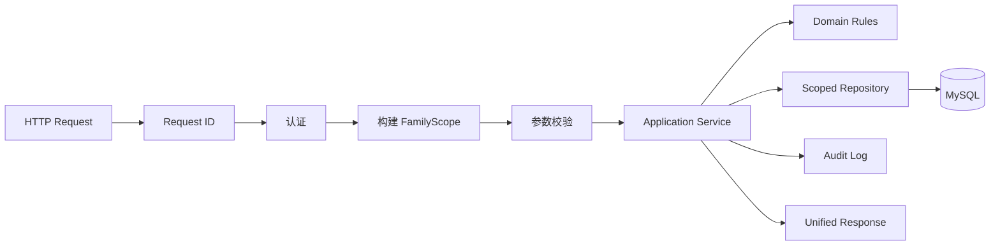

# 猫宅 MeowHome 后端开发方案

> 文档版本：v1.0  
> 编制日期：2026-08-06  
> 对应总方案：[MeowHome-开发方案.md](./MeowHome-开发方案.md)  
> 技术栈：Golang、Gin、GORM、MySQL 8、OpenAPI 3、Swagger；Redis 预留

## 1. 后端目标

后端是家庭权限、正式健康数据、统计结果和 AI 安全边界的唯一可信执行方。核心目标是确保跨家庭和多猫数据严格隔离、专业记录结构化、写入事务一致、AI 输出可验证可追溯，并在 AI、OCR 或 Redis 不可用时继续提供基础业务。

后端必须保证：

1. 所有业务资源从登录用户的 `FamilyScope` 授权，不能信任客户端单独提交的 `family_id`。
2. 单猫记录明确绑定 `cat_id`；共同事件通过关联表列出全部猫咪，禁止默认猜测。
3. MySQL 是正式数据的唯一事实来源，专业记录不堆入无约束 JSON。
4. AI 解析只生成草稿，经过 Schema、业务和归属校验并由用户确认后才能事务入库。
5. 健康摘要只读取确定性聚合结果，高风险等级只由版本化规则产生。
6. migration、审计、幂等、导出和备份具备可测试、可恢复的工程实现。

## 2. 职责边界

### 2.1 后端负责

- 认证、Token 生命周期、家庭成员角色和资源级权限。
- 数据建模、数据库约束、事务、软删除、审计和 migration。
- 家庭、猫咪、记录、医疗、提醒、用药、库存、支出、媒体和导出 API。
- 统一时间线、健康聚合、数据完整度和趋势数据。
- 提醒实例生成、用药打卡、库存流水和幂等控制。
- OpenAI-compatible AI Provider、OCR Provider、JSON Schema 和状态机。
- 文件安全校验、存储适配、受控下载和生命周期管理。
- OpenAPI、统一响应、错误码、日志、请求 ID、指标和健康检查。

### 2.2 后端不负责

- 兽医诊断、处方或未经评审的医疗结论。
- 用 AI 替代结构化统计、规则引擎、权限判断或事务逻辑。
- 第一版拆分微服务或强制依赖 Redis。
- 社交、电商、计费、医院系统直接集成及设备控制。
- 将客户端缓存或 AI 原文作为未经确认的正式记录。

## 3. 架构原则

- 首版使用模块化单体，保持部署简单，同时通过领域边界控制耦合。
- 依赖方向为 `transport -> application -> domain`，基础设施通过接口实现，领域层不依赖 Gin、GORM 或具体 AI SDK。
- Handler 只做协议解析、调用服务和响应映射；业务事务由 Application Service 组织。
- Repository 必须接收授权后的 `FamilyScope`，查询条件同时包含资源 ID 和 `family_id`。
- GORM 负责映射和查询，版本化 SQL migration 负责结构演进，生产禁止 `AutoMigrate`。
- 外部 AI、OCR、对象存储、时钟和 ID 生成器都以接口注入，测试使用 Fake。
- 非必要外部依赖失败时返回可识别降级状态，不影响核心 API readiness。

## 4. 建议目录结构

```text
backend/
├─ cmd/
│  ├─ server/
│  ├─ migrate/
│  └─ seed/
├─ internal/
│  ├─ application/
│  │  ├─ auth/ family/ cat/ record/ health/
│  │  ├─ medication/ reminder/ medical/
│  │  ├─ inventory/ moment/ ai/ export/
│  ├─ domain/
│  │  ├─ model/
│  │  ├─ valueobject/
│  │  ├─ repository/
│  │  ├─ service/
│  │  └─ errors/
│  ├─ infrastructure/
│  │  ├─ persistence/mysql/
│  │  ├─ ai/openai_compatible/
│  │  ├─ ocr/
│  │  ├─ storage/
│  │  ├─ scheduler/
│  │  └─ observability/
│  ├─ transport/http/
│  │  ├─ handler/ middleware/ request/ response/ router/
│  └─ platform/
│     ├─ config/ clock/ id/ transaction/
├─ migrations/
├─ seeds/
├─ openapi/
│  ├─ openapi.yaml
│  ├─ schemas/
│  └─ examples/
├─ tests/
│  ├─ fixtures/
│  ├─ integration/
│  └─ contract/
└─ go.mod
```

目录以领域能力划分，不按 `controllers/models/utils` 全局堆放。共享代码只有在语义稳定且确实跨领域时才进入 `platform`。

## 5. 请求处理与授权链



### 5.1 FamilyScope

`FamilyScope` 至少包含 `user_id`、`family_id`、`member_id`、`role`、权限集合和家庭时区。它只能由认证中间件与服务端成员关系构建，不能从客户端请求体反序列化。

- 所有家庭业务 Application Service 的首个参数为 Context 和 FamilyScope。
- 根据资源 ID 查询时仍附加 `family_id`；不存在和无权访问采用不泄露资源存在性的错误策略。
- 多猫 ID 列表必须批量验证全部属于同一家庭，部分合法不能放行。
- 管理员专属操作在应用层再次校验，避免只依赖路由中间件。

### 5.2 统一响应与错误

```json
{
  "code": "SUCCESS",
  "message": "ok",
  "data": {},
  "request_id": "01J..."
}
```

错误分层：

- 协议错误：无效 JSON、参数格式、上传过大。
- 认证授权：`AUTH_REQUIRED`、`TOKEN_EXPIRED`、`FAMILY_FORBIDDEN`。
- 业务错误：`CAT_NOT_FOUND`、`INVALID_RECORD_STATE`、`CONFLICT`。
- 外部依赖：`AI_UNAVAILABLE`、`OCR_UNAVAILABLE`、`STORAGE_UNAVAILABLE`。
- AI 数据：`AI_INVALID_OUTPUT`、`AI_NEEDS_CLARIFICATION`、`AI_SESSION_EXPIRED`。

领域错误映射为稳定 HTTP 状态码和业务码，响应不得包含内部 SQL、堆栈、文件路径或模型原文。

## 6. 数据库方案

### 6.1 基础约定

- 主键使用 ULID 字符串；外键类型保持一致。
- 根实体以外的家庭业务表包含 `family_id`；单猫表同时包含 `cat_id`。
- 可变业务表包含 `created_by`、`created_at`、`updated_at`、`deleted_at`。
- 正式时间存 UTC，接口使用 RFC 3339；周期提醒保存本地规则及 IANA 时区。
- 金额使用最小货币单位整数；重量、容量、温度和检验值使用明确单位及 decimal。
- 可搜索和统计的业务字段使用结构化列；JSON 只用于版本化快照、扩展显示元数据和 AI Schema 原始结果。
- 外键、非空、唯一、范围、状态约束和应用校验共同保证数据质量。

### 6.2 领域表

| 模块 | 表 |
|---|---|
| 身份家庭 | `users`、`families`、`family_members`、`refresh_tokens` |
| 猫咪 | `cats`、`cat_health_profiles` |
| 统一事件 | `daily_records`、`daily_record_cats`、`record_tags` |
| 专业记录 | `feeding_records`、`drinking_records`、`elimination_records`、`vomiting_records`、`weight_records`、`mental_state_records`、`symptom_records` |
| 扩展记录 | `diet_change_records`、`behavior_records`、`custom_records` |
| 用药预防 | `medications`、`medication_plans`、`medication_logs`、`vaccinations`、`deworming_records` |
| 医疗 | `medical_visits`、`medical_documents`、`medical_test_results` |
| 提醒协作 | `reminders`、`reminder_occurrences`、`care_tasks` |
| 库存支出 | `inventory_items`、`inventory_transactions`、`expenses` |
| 媒体时光 | `media_assets`、`record_media_assets`、`timeline_events`、`cat_interactions` |
| AI | `ai_parse_sessions`、`ai_analysis_reports`、`ai_evidence_links` |
| 治理 | `audit_logs`、`export_jobs`、`idempotency_keys` |

### 6.3 统一事件事务

创建专业记录时在一个事务内：

1. 校验 FamilyScope、猫咪归属和请求幂等键。
2. 创建 `daily_records` 事件头。
3. 创建对应专业明细，强制 `daily_record_id` 唯一。
4. 写入多猫关联、附件关联和标签。
5. 写审计记录或事务后事件。
6. 提交并保存幂等结果。

任何明细失败都回滚事件头，禁止产生无明细的半成品专业事件。

### 6.4 索引与并发

- 时间线：`(family_id, cat_id, occurred_at DESC, id)`。
- 类型趋势：`(family_id, cat_id, record_type, occurred_at)`。
- 提醒实例：`(family_id, status, scheduled_at)`。
- 打卡唯一：`(medication_plan_id, scheduled_at)`。
- AI 确认唯一：`confirmation_key` 和会话状态条件。
- 库存流水唯一：`idempotency_key`；库存变更使用事务和乐观锁或行锁。
- 软删除后的唯一性按业务分别采用组合键、状态字段或归档策略处理。

## 7. API 规划

### 7.1 契约原则

- 统一前缀 `/api/v1`，OpenAPI 3 是对前端的唯一接口契约。
- 资源使用名词复数，操作端点只用于 `confirm`、`complete`、`skip` 等状态迁移。
- 列表支持分页、白名单排序和时间范围；限制最大页大小和最大日期跨度。
- 写接口接收 `Idempotency-Key`；响应附带 `request_id`。
- DTO 与数据库 Model 分离，避免泄露内部字段或 Mass Assignment。
- 不兼容变更通过版本或迁移期兼容字段处理，禁止直接破坏已发布前端。

### 7.2 接口模块

| 模块 | 主要能力 |
|---|---|
| `/auth`、`/me` | 注册、登录、刷新、登出、当前用户 |
| `/families` | 家庭 CRUD、成员邀请/角色/移除、权限集 |
| `/cats` | 猫咪 CRUD、健康档案、头像 |
| `/records` | 记录查询、专业记录 CRUD、附件和标签 |
| `/timeline` | 家庭/猫咪时间线、类型和时间过滤 |
| `/health-aggregate`、`/trends` | 聚合、数据覆盖、趋势序列 |
| `/medications` | 药品、计划、计划实例和打卡 |
| `/vaccinations`、`/deworming-records` | 预防记录及下次日期 |
| `/reminders`、`/care-tasks` | 周期规则、提醒实例、任务完成 |
| `/medical-visits`、`/medical-documents` | 就诊、上传、提取、指标确认 |
| `/inventory-items`、`/inventory-transactions` | 库存及不可变流水 |
| `/expenses` | 支出 CRUD 和月度统计 |
| `/timeline-events`、`/cat-interactions` | 成长时光和多猫互动 |
| `/ai` | 记录解析、确认、报告、问答、会话删除 |
| `/exports`、`/backups` | 导出、受控下载、备份与恢复预检 |

## 8. 认证与权限

- 首版默认用户名/邮箱加密码，使用强密码哈希。
- Access Token 短期有效，Refresh Token 可轮换、可吊销并保存哈希或不可逆标识。
- 成员角色为 `admin` 和 `member`；具体权限以服务端权限集合为准。
- 管理员可管理家庭、成员、AI 配置、恢复和删除；成员可查看猫咪、添加记录和完成任务。
- 登录、刷新、邀请、角色变化、成员移除、导出和删除写入审计。
- 敏感接口增加速率限制；Redis 未启用时采用进程内保守限流，不能用于跨实例一致性。
- Token 和认证日志不记录明文凭证。

## 9. 健康聚合服务

输入：授权 FamilyScope、`cat_id`、`date_from`、`date_to`。

输出固定 DTO：

- 数据范围、家庭时区、记录首尾时间。
- 体重起止、变化量、变化率和采样序列。
- 每日食量、相对正常比例、饮水量及缺失标记。
- 排便/排尿频率、呕吐次数、精神状态和症状。
- 同期用药、换粮、就诊及关联记录。
- 应记录天数、实际覆盖天数、字段缺失和不可比较原因。

实现要求：

- 统计由确定性 Go 代码完成，AI 不参与计算。
- 空缺和零严格区分；单位先规范化，无法换算则标为不可比较。
- 结果包含数据版本/生成时间，供 AI 报告和证据引用。
- 7/30/90 天统一按受限日期范围计算，不编写相互漂移的分支。
- 使用固定 30 天种子数据生成期望输出进行回归测试。

## 10. 提醒、用药与库存

### 10.1 提醒调度

- `reminders` 保存规则，`reminder_occurrences` 保存具体触发实例。
- 支持单次、每日、每周、每月和受限自定义周期；规则按家庭时区计算，实例存 UTC。
- 调度器按时间窗口扫描并用唯一约束避免重复实例。
- 单实例先使用 MySQL 锁；多实例部署前引入 Redis 分布式锁或队列。
- 完成、跳过和逾期为明确状态迁移，并记录操作者和时间。

### 10.2 用药打卡与库存

- 药品定义、用药计划和实际打卡分离。
- 打卡以计划和计划发生时间唯一，客户端重试返回相同结果。
- 库存数量只通过不可变流水改变，调整也作为独立流水。
- 出库在事务内检查并更新数量，使用锁或版本号处理并发。
- 低库存由当前量和阈值确定；可生成提醒但不自动购买。
- 金额使用最小货币单位，月度统计按家庭时区归属月份。

## 11. AI 与 OCR 架构

### 11.1 Provider 抽象

业务层只依赖 `AIProvider.GenerateStructured` 和 `OCRProvider.Extract` 等接口。OpenAI-compatible 实现从环境变量读取 Base URL、API Key、模型、超时和重试策略；禁止将具体供应商写入领域逻辑。

### 11.2 自然语言解析状态机

```text
processing
  ├─> draft ──> confirmed
  │          ├─> rejected
  │          └─> expired
  ├─> needs_clarification ──> draft
  └─> failed
```

流程要求：

1. 读取当前家庭猫咪的最小识别信息。
2. 保存原始输入和会话版本，调用 Provider 获取严格 JSON。
3. 执行 JSON、Schema、枚举、时间、数值和猫咪归属校验。
4. 猫咪不明确时返回待澄清状态，禁止猜测。
5. 确认时重新校验客户端编辑后的草稿。
6. 使用单一事务创建全部正式记录、关联及审计。
7. 幂等确认返回同一批记录，不能生成第二份结果。

### 11.3 病历、摘要与问答

- 上传先保存原文件和元数据；OCR/AI 作为可重试任务。
- OCR 文本和结构化结果是草稿，医疗指标确认后才进入正式表。
- 指标保存原名称、标准名称、值、单位、参考区间、异常标记、页码和证据区域。
- 摘要输入仅来自健康聚合 DTO，不允许模型自由访问 Repository。
- 确定性规则先产生风险 ID、等级、触发值和证据；AI 只解释。
- 每条报告事实通过 `ai_evidence_links` 指向记录、指标或聚合版本。
- 问答限制当前家庭及猫咪，证据不足时返回明确不足状态。
- 保存模型、Prompt/Schema 版本、生成时间、数据范围、耗时和必要用量元数据。
- AI 关闭、超时、限流和无效 JSON 不影响记录、聚合和规则 API。

## 12. 文件、导出与备份

### 12.1 文件存储

- 定义 `ObjectStorage` 接口，本地使用受控目录，生产可切换 S3-compatible。
- 校验扩展名、MIME、文件签名、大小和数量，使用随机对象键。
- 数据库只存对象键、原文件名、类型、大小、哈希、创建者和处理状态。
- 下载先验证 FamilyScope，再通过受控流或短期签名 URL 返回。
- 视频转码不纳入 MVP，可限制浏览器支持格式。

### 12.2 导出、备份与恢复

- `export_jobs` 管理状态、范围、格式、文件键、过期时间和错误。
- JSON 提供完整结构，CSV 按记录类型拆分，就诊报告面向阅读。
- 完成文件下载仍需权限校验并写审计，过期文件可清理。
- 备份包含数据库一致性快照和对象文件清单。
- 恢复先做完整性、版本、家庭范围和冲突预检，再由管理员确认。
- 定期执行恢复演练，不能仅验证备份生成成功。

## 13. 日志、审计与可观测性

- 请求 ID 由入口生成或安全透传，并贯穿日志、错误响应和外部调用。
- 结构化日志包含时间、级别、请求 ID、路由、用户/家庭 ID、状态、耗时和错误码。
- 日志不得包含密码、Token、AI Key、完整病历、完整 Prompt/响应或文件正文。
- 审计采用追加式记录，覆盖权限、猫咪删除、医疗数据、AI 确认、配置、导出和恢复。
- 提供存活与就绪检查；MySQL 影响 readiness，AI/OCR 不影响核心 readiness。
- 指标至少覆盖请求量、错误率、延迟、数据库连接、任务积压、上传失败、AI 无效 JSON 率和提醒延迟。

## 14. 安全方案

- 配置来自环境变量或密钥管理，`.env.example` 只放占位符。
- 数据库账号最小权限，生产只允许 TLS 和受控网络访问。
- 输入统一做长度、枚举、时间范围和资源归属校验；排序字段使用白名单。
- GORM 使用参数绑定，禁止拼接用户输入的 SQL、路径或对象键。
- 上传限制类型、大小、像素和解压风险；文件名不参与真实存储路径。
- 登录、AI、上传、导出和恢复接口限流，并记录异常频率。
- 删除默认软删除；敏感删除遵循权限、二次确认和审计要求。
- 对敏感资源采用不泄露存在性的错误策略，并用自动化越权测试验证。

## 15. 测试策略

### 15.1 单元测试

- 领域值对象、单位换算、时间范围和状态机。
- 健康聚合、覆盖率、缺失值及趋势计算。
- 提醒周期、跨月、闰年和时区边界。
- AI JSON Schema、猫咪歧义、规则引擎和证据生成。
- 错误映射、幂等行为和库存计算。

### 15.2 Repository 与 API 集成测试

- 从空 MySQL 执行 migration，验证外键、唯一、软删除、事务和并发。
- 家庭 A/B 交叉资源 ID 的读、写、删、导出和 AI 聚合越权。
- 事件头与专业明细一致性、库存流水重算。
- 参数、分页、排序、时间范围、统一响应和请求 ID。
- 日常记录、AI 确认事务、用药打卡、提醒生成和导出。
- 上传类型/大小、受控下载和 OpenAPI 响应契约。

### 15.3 AI 故障测试

Fake Provider 覆盖合法 JSON、语法错误、Schema 错误、未知/歧义猫咪、超时、限流、5xx、空/超大响应、重复或并发确认、过期会话。AI 关闭时普通记录、聚合和规则仍须正常。

## 16. Migration 与种子数据

- migration 采用递增版本和 `up/down` 配对，发布后不得修改既有版本。
- CI 从空库执行到最新版本，并验证受支持的回滚路径。
- 数据与结构迁移分步，破坏性变更采用扩展—迁移—收缩策略。
- 种子命令仅在非生产环境启用，必须显式确认环境。
- 固定生成“小家的猫宅”、小白、小橘和连续 30 天数据。
- 种子带开发批次标识、固定随机源和聚合期望夹具。

## 17. 配置与运行

配置至少包括服务环境、日志、超时、允许源、MySQL、连接池、Token 密钥、文件存储、上传限制、AI/OCR Provider 和 Redis 预留地址。

启动时校验配置，但 AI/OCR 缺失应将对应能力标为关闭，而不是阻止基础服务启动。生产缺少认证密钥或数据库配置必须拒绝启动。

## 18. 分阶段开发计划

### B1：领域、数据与 API 设计（3–5 人日）

- 输出领域边界、权限矩阵、ER、字段字典和错误码。
- 定义 OpenAPI 骨架、AI Schema、状态机和规则格式。
- 确认时区、单位、软删除、幂等、文件和恢复策略。

退出条件：前端可基于 OpenAPI 和示例开始 Mock 开发，数据归属无歧义。

### B2：基础工程（4–6 人日）

- 初始化 Go、Gin、配置、日志、请求 ID、错误和健康检查。
- 接入 MySQL、GORM、migration、事务和 Repository。
- 建立 OpenAPI、Docker Compose、Makefile、测试库和 CI。
- 实现认证骨架、FamilyScope、存储与 Provider 接口。

退出条件：空环境一条命令启动，迁移、测试、静态检查和构建通过。

### B3：家庭、成员和猫咪（5–7 人日）

- 实现认证、当前用户、家庭、角色、猫咪和健康档案。
- 实现头像、软删除、审计和完整越权测试。

退出条件：小家的猫宅、小白和小橘可通过 API 建立，跨家庭访问拒绝。

### B4：记录、时间线和聚合（8–12 人日）

- 建立统一事件、专业明细、附件/标签/多猫关联和事务 CRUD。
- 实现时间线、分页、过滤、健康聚合及趋势。
- 提供固定 30 天种子和聚合期望测试。

退出条件：记录不串家庭/猫，事件头与明细一致，聚合测试通过。

### B5：提醒、用药、库存和任务（7–10 人日）

- 实现提醒规则/实例、调度、时区、完成/跳过。
- 实现药品、计划、打卡、疫苗、驱虫、复诊。
- 实现库存流水、预警、支出统计和照顾任务。

退出条件：提醒不重复、打卡幂等、库存可重算、并发测试通过。

### B6：AI 自然语言记录（5–8 人日）

- 实现 Provider、Fake、配置、超时、有限重试和降级。
- 实现 Prompt/Schema 版本、会话、歧义、草稿和审计。
- 实现确认事务、再次校验、幂等和会话删除。

退出条件：未经确认无正式数据；非法 JSON、歧义和重复确认测试通过。

### B7：医疗、OCR、摘要与问答（8–12 人日）

- 实现安全上传、原文件、OCR、提取任务及指标确认。
- 实现规则、AI 摘要、证据和受控档案问答。
- 实现就诊前报告及模型/Prompt/数据范围审计。

退出条件：AI 事实有证据，高风险只来自规则，故障不阻塞手工流程。

### B8：时光、导出、备份与恢复（6–9 人日）

- 实现媒体、成长、互动、纪念日和月度回顾数据。
- 实现 JSON/CSV/就诊报告导出及受控下载。
- 实现备份清单、恢复预检/确认和隐私配置。

退出条件：导出不串家庭，备份恢复演练通过。

### B9：整体验收（4–7 人日）

- 运行单元、集成、契约、故障、migration 和构建测试。
- 完成权限、上传、日志脱敏、限流、恢复和 AI 安全检查。
- 优化慢查询，补齐文档和已知限制。

退出条件：后端验收均有证据，Docker Compose 全新启动和生产构建通过。

## 19. 前后端联调约定

| 契约项 | 后端责任 | 前端责任 |
|---|---|---|
| OpenAPI | 维护 Schema、枚举、示例和错误码 | 生成 TS 类型，不另建冲突 DTO |
| 权限 | 最终校验并返回权限集 | 按权限展示并处理 401/403 |
| 时间 | 返回 UTC/RFC 3339 与家庭时区 | 转为家庭时区展示和录入 |
| 幂等 | 保存并复用逻辑操作结果 | 同一重试复用同一 Key |
| AI | 状态机、Schema、证据和安全边界 | 草稿编辑、确认和依据展示 |
| 趋势 | 数值、单位和缺失标记 | 不改变语义地可视化 |
| 上传 | 安全校验、状态、权限下载 | 进度、取消、重试和预览 |
| 错误 | 稳定 code、message、request_id | 分级反馈并展示请求 ID |

接口开发顺序为“OpenAPI 与示例 → 后端实现与契约测试 → 前端取消 Mock 联调”。不兼容变更应先更新和评审契约。

## 20. 质量门禁与完成定义

每阶段交付实现代码、migration、OpenAPI、测试、配置样例、变更清单、验证命令、已知风险和下一阶段计划。

合并前执行：`gofmt`、`go vet`、约定静态检查、单元/集成/契约测试、`go build`、OpenAPI 校验、空库 migration、关键回滚验证及敏感日志检查。

后端完成标准：

- 所有资源通过 FamilyScope 隔离，跨家庭和跨猫访问测试通过。
- 专业记录结构化且与统一事件头保持事务一致。
- 健康聚合确定、可重复、明确标注缺失，不依赖 AI 计算。
- AI 草稿、病历提取、摘要、规则和问答均有状态、版本、证据及降级路径。
- 提醒不重复、用药打卡和库存流水幂等，库存可由流水重算。
- 文件受控存储和下载，日志脱敏，导出及备份不泄露其他家庭数据。
- OpenAPI、migration、种子、测试、构建和 Docker Compose 启动全部通过。

