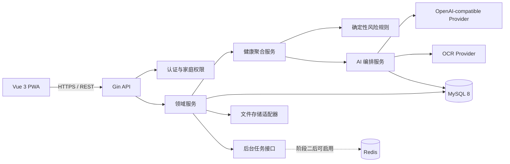
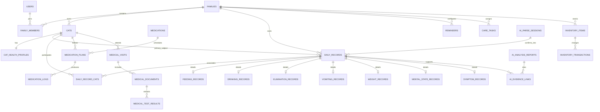

# 猫宅 MeowHome 项目开发方案

> 文档版本：v1.0  
> 编制日期：2026-08-06  
> 项目形态：前后端分离、移动优先 Web/PWA  
> 当前状态：开发前规划，阶段 1 输入文档

## 1. 项目目标与成功标准

“猫宅 MeowHome”面向个人及小型家庭中的多猫照护场景，为每只猫建立独立、连续、可追溯的生活与健康档案，并将日常记录、医疗资料、提醒、库存、支出、家庭任务和成长时光统一到同一个家庭空间中。

项目首先解决三个核心问题：

1. **不混猫**：任何记录、统计、AI 输入和导出都必须明确归属于家庭及一只或多只指定猫咪。
2. **可追溯**：健康结论必须能够追溯到原始记录、原始文件、计算规则和 AI 生成上下文。
3. **可降级**：AI、OCR、Redis 或外部对象存储不可用时，手工记录、查询、提醒、趋势和导出等核心功能仍然可用。

项目最终验收以原始需求中的 16 项标准为准。第一版优先交付可日常使用的闭环，而不是一次性铺开所有高级能力。

## 2. 系统边界

### 2.1 系统负责

- 家庭、成员、角色和数据权限管理。
- 多猫独立档案及健康基础信息管理。
- 生活、健康、用药、就诊、换粮、行为和时光记录。
- 统一事件时间线和确定性健康聚合统计。
- 疫苗、驱虫、用药、复诊、测重、库存及自定义提醒。
- 库存流水、支出及月度统计。
- 医疗文件上传、OCR/AI 提取草稿、人工确认和结构化保存。
- 基于受控聚合数据的 AI 解析、摘要、风险解释和档案问答。
- JSON/CSV 数据导出、备份和恢复能力。
- PWA 安装、离线查看壳层及离线草稿。

### 2.2 第一版不负责

- 兽医诊断、处方生成、药量决策或紧急医疗分诊。
- 宠物社交、电商、内容社区、公开分享和广告推荐。
- 智能喂食器、饮水机等硬件的直接控制；仅预留设备记录来源。
- 宠物医院 HIS/LIS 的标准化对接；先采用文件上传和人工确认。
- 多租户商业计费、订阅套餐和运营后台。
- 在第一阶段启用 Redis；仅定义缓存、限流和任务队列适配接口。

### 2.3 关键业务约束

- 每次业务查询必须从当前登录成员的家庭权限出发，不能只依赖客户端提交的 `family_id`。
- 单猫记录必须有且只有一个 `cat_id`；双猫互动或共同事件通过关联表明确列出所有猫，禁止使用“默认猫”。
- AI 只能生成草稿或解释确定性结果，不能绕过确认直接创建正式健康记录。
- AI 分析只能读取健康聚合服务的白名单输出，不能获得任意 SQL 或数据库访问能力。
- 所有医疗提示均展示“本应用不构成医疗诊断”；高风险规则触发时建议尽快联系兽医。
- 删除默认采用软删除；猫咪、医疗文件及家庭级删除需二次确认并写入审计日志。

## 3. 版本范围与优先级

### 3.1 MVP（必须完成）

- 登录及个人模式、家庭和成员基础能力。
- 猫咪档案、健康档案和两只猫切换。
- 喂食、饮水、排便、排尿、呕吐、体重、精神、症状、用药、换粮、就诊、行为、自定义事件记录。
- 今日页、快速记录、猫咪列表/详情、统一时间线、7/30 天趋势。
- 用药计划与打卡、疫苗/驱虫/复诊提醒、基础库存及库存预警。
- 自然语言解析为可编辑草稿、人工确认和事务入库。
- 病历文件上传、提取草稿、人工确认和原文件查看。
- 确定性健康聚合、AI 日/周/月摘要及证据引用。
- JSON/CSV 导出、PWA 安装和离线草稿。
- Docker Compose、本地迁移、种子数据、测试、OpenAPI 和 README。

### 3.2 MVP 后增强

- 年度报告、视频转码、跨家庭协作增强。
- 可插拔设备接入、医院数据导入和更丰富 OCR。
- Web Push、邮件等远程通知渠道。
- Redis 缓存、分布式任务队列、对象存储和异步报表扩展。
- 更复杂的个体基线规则、指标单位换算和兽医协作导出模板。

## 4. 总体技术架构



### 4.1 前端

- Vue 3 + TypeScript + Vite，使用 Composition API 和 `<script setup>`。
- Pinia 管理登录态、家庭上下文、当前猫咪、离线草稿及全局提醒；服务端数据不做无边界全局缓存。
- Vue Router 按业务模块懒加载，并通过路由守卫处理初始化、登录和家庭权限。
- Vant 4 提供移动端基础组件，ECharts 提供健康趋势，Axios 统一附加 Token、请求 ID 和错误映射。
- vite-plugin-pwa 缓存静态壳层；业务写操作采用 IndexedDB 离线草稿，不在无用户确认时自动提交健康记录。
- Vitest + Vue Test Utils 测试关键逻辑；ESLint + Prettier 约束代码风格。

### 4.2 后端

- Go + Gin + GORM，按 `handler -> application/service -> domain -> repository` 分层。
- MySQL 8 是唯一事实数据源；GORM 负责数据访问，版本化 SQL migration 负责结构变更，禁止线上使用自动迁移替代 migration。
- OpenAPI 3 作为接口契约，Swagger UI 用于联调；统一响应、错误码、分页和时间格式。
- 中间件统一实现认证、家庭权限、请求 ID、结构化日志、恢复、审计和基础限流。
- 定时任务先采用单实例数据库锁方案；引入 Redis 后可替换为分布式锁和任务队列。
- 文件存储定义 `ObjectStorage` 接口，本地开发使用本地卷，生产可切换 S3-compatible 存储。

### 4.3 AI 与 OCR

- 业务层仅依赖 `AIProvider` 和 `OCRProvider` 接口，不出现具体供应商类型。
- AI 配置由服务端环境变量提供：`AI_BASE_URL`、`AI_API_KEY`、`AI_MODEL`、超时、重试和开关。
- 所有结构化生成使用版本化 JSON Schema 校验；校验失败只保留失败会话并返回可恢复错误。
- Prompt、Schema、模型、数据范围、原始响应摘要、耗时和 token 用量均记录版本信息，但日志不输出密钥和完整病历。
- 生产日志只保留必要元数据；原始 AI 输入输出保存在受权限控制的业务表中，并允许用户删除会话。

## 5. 建议项目结构

```text
MeowHome/
├─ README.md
├─ Makefile
├─ docker-compose.yml
├─ .env.example
├─ .editorconfig
├─ docs/
│  ├─ product-spec.md
│  ├─ architecture.md
│  ├─ data-model.md
│  ├─ api-design.md
│  ├─ ai-safety.md
│  ├─ er-diagram.md
│  └─ development-tasks.md
├─ backend/
│  ├─ cmd/server/
│  ├─ internal/
│  │  ├─ application/
│  │  ├─ domain/
│  │  ├─ repository/
│  │  ├─ transport/http/
│  │  ├─ middleware/
│  │  ├─ ai/
│  │  ├─ ocr/
│  │  ├─ storage/
│  │  ├─ jobs/
│  │  └─ platform/
│  ├─ migrations/
│  ├─ seeds/
│  ├─ openapi/
│  ├─ tests/
│  └─ go.mod
├─ frontend/
│  ├─ src/
│  │  ├─ api/
│  │  ├─ assets/
│  │  ├─ components/
│  │  ├─ composables/
│  │  ├─ layouts/
│  │  ├─ modules/
│  │  ├─ router/
│  │  ├─ stores/
│  │  ├─ styles/
│  │  ├─ types/
│  │  └─ utils/
│  ├─ tests/
│  └─ package.json
├─ deploy/
│  ├─ nginx/
│  └─ scripts/
└─ storage/                 # 本地开发文件卷，不提交用户文件
```

前端 `modules` 按 `today`、`records`、`cats`、`timeline`、`family`、`reminders`、`medical`、`inventory`、`ai` 拆分，避免按页面堆叠无法复用的代码。

## 6. 核心领域与数据设计

### 6.1 通用字段规范

- 主键统一使用 ULID 字符串，便于离线生成、排序和跨系统导出。
- 除 `users`、`families` 等根实体外，所有家庭业务表包含 `family_id`；单猫业务表同时包含 `cat_id`。
- 可变业务表包含 `created_by`、`created_at`、`updated_at`、`deleted_at`。
- 业务时间统一存 UTC，API 使用 RFC 3339，前端按用户时区展示；日统计额外携带家庭时区。
- 金额使用最小货币单位整数，重量/容量使用固定单位的 `decimal`，禁止浮点累计。
- JSON 只用于确实可扩展的快照、Schema 输出或显示元数据；可查询的专业字段必须有明确列和约束。
- 唯一索引、外键、范围检查和枚举值在数据库及应用层双重约束。

### 6.2 统一事件模型

`daily_records` 是事件头和统一时间线索引，保存：

- `id`、`family_id`、主 `cat_id`、`record_type`、`occurred_at`、`source`、`severity`。
- `title`、`note`、`medical_visit_id`、`related_record_id`、创建审计字段。
- 专业字段不放在事件头 JSON 中，而是由对应明细表通过 `daily_record_id` 一对一关联。
- 多猫事件通过 `daily_record_cats` 关联表明确关联对象；单猫专业记录仍要求主 `cat_id`。
- 附件通过 `record_media_assets` 关联，标签通过 `record_tags` 关联。

这种设计同时保证统一时间线查询效率、专业字段约束和后续新增记录类型的可维护性。

### 6.3 实体分组

| 领域 | 核心表 | 说明 |
|---|---|---|
| 身份与家庭 | `users`、`families`、`family_members` | 成员角色为 admin/member，成员关系是授权入口 |
| 猫咪档案 | `cats`、`cat_health_profiles` | 基本档案与疾病、过敏、禁忌等健康信息分离 |
| 事件索引 | `daily_records`、`daily_record_cats`、`record_tags` | 统一时间线、共同事件和标签 |
| 日常明细 | `feeding_records`、`drinking_records`、`elimination_records`、`vomiting_records`、`weight_records`、`mental_state_records`、`symptom_records` | 每类保留可统计字段及单位 |
| 其他记录 | `diet_change_records`、`behavior_records`、`custom_records` | 换粮、行为及受限自定义记录 |
| 用药 | `medications`、`medication_plans`、`medication_logs` | 药品字典、计划和实际打卡分开 |
| 预防与医疗 | `vaccinations`、`deworming_records`、`medical_visits`、`medical_documents`、`medical_test_results` | 原文件与结构化指标并存 |
| 计划协作 | `reminders`、`reminder_occurrences`、`care_tasks` | 规则和实际触发实例分离，便于完成/跳过审计 |
| 库存支出 | `inventory_items`、`inventory_transactions`、`expenses` | 库存只由流水改变，当前量可校验重算 |
| 时光媒体 | `media_assets`、`record_media_assets`、`timeline_events`、`cat_interactions` | 文件元数据、时间线和双猫互动 |
| AI | `ai_parse_sessions`、`ai_analysis_reports`、`ai_evidence_links` | 草稿状态机、报告版本和证据引用 |
| 治理 | `audit_logs`、`export_jobs` | 敏感变更审计及异步导出 |

### 6.4 关键实体关系



### 6.5 重要索引与隔离策略

- 高频时间线：`daily_records(family_id, cat_id, occurred_at DESC, id)`。
- 类型趋势：`daily_records(family_id, cat_id, record_type, occurred_at)`。
- 待办提醒：`reminder_occurrences(family_id, status, scheduled_at)`。
- 用药打卡唯一约束：`(medication_plan_id, scheduled_at)`，防止重复打卡。
- AI 确认幂等唯一约束：`ai_parse_sessions.confirmation_key`。
- 库存流水幂等唯一约束：`inventory_transactions.idempotency_key`。
- 所有仓储方法接收已授权的 `FamilyScope`；即使已知记录 ID，更新和删除条件仍包含 `family_id`。
- 集成测试必须用家庭 A/B 的交叉 ID 验证读取、修改、导出和 AI 分析均无法越权。

## 7. API 设计方案

### 7.1 基础规范

- API 前缀：`/api/v1`。
- 认证：短期 Access Token + 可轮换 Refresh Token；密码采用强哈希，生产环境仅 HTTPS。
- 响应统一为：

```json
{
  "code": "SUCCESS",
  "message": "ok",
  "data": {},
  "request_id": "01J..."
}
```

- 分页使用 `page`/`page_size`，大时间线可升级为游标；最大页大小由服务端限制。
- 列表统一支持白名单排序、RFC 3339 时间范围过滤和明确时区。
- 创建/确认/打卡/出入库接受 `Idempotency-Key`，避免移动端重试造成重复写入。
- HTTP 状态码表达协议结果，`code` 表达稳定业务错误，如 `AUTH_REQUIRED`、`FAMILY_FORBIDDEN`、`CAT_NOT_FOUND`、`AI_INVALID_OUTPUT`、`AI_UNAVAILABLE`、`CONFLICT`。
- 写入接口先做参数校验，再做家庭权限和对象归属校验，最后进入事务。

### 7.2 接口分组

| 分组 | 代表接口 |
|---|---|
| 认证 | `POST /auth/register`、`POST /auth/login`、`POST /auth/refresh`、`GET /me` |
| 家庭成员 | `/families`、`/families/{id}/members`、成员角色更新与移除 |
| 猫咪 | `/families/{fid}/cats`、`/cats/{id}`、`/cats/{id}/health-profile` |
| 日常记录 | `/families/{fid}/records`、`/records/{id}`、各专业类型的创建/更新接口 |
| 时间线 | `GET /families/{fid}/timeline`、`GET /cats/{id}/timeline` |
| 聚合趋势 | `GET /cats/{id}/health-aggregate`、`GET /cats/{id}/trends/{metric}` |
| 用药预防 | `/cats/{id}/medication-plans`、`/medication-logs`、`/vaccinations`、`/deworming-records` |
| 提醒任务 | `/families/{fid}/reminders`、`/reminder-occurrences`、`/care-tasks` |
| 医疗资料 | `/cats/{id}/medical-visits`、`/medical-documents`、上传、提取和确认 |
| 库存支出 | `/families/{fid}/inventory-items`、`/inventory-transactions`、`/expenses`、月度统计 |
| AI | `/ai/record-parses`、`/ai/record-parses/{id}/confirm`、`/ai/reports`、`/ai/questions` |
| 数据治理 | `/families/{fid}/exports`、导出状态/下载、备份、恢复预检 |

详细 OpenAPI 文档应在阶段 1 先定义资源、Schema 和错误码，再在后续阶段随实现同步更新。接口不可仅靠 Swagger 注解临时生成而缺少版本审查。

## 8. 健康聚合与趋势方案

健康聚合服务接受 `family_scope`、`cat_id`、`date_from`、`date_to`，先验证猫咪归属，再查询结构化记录，输出固定 DTO：

- 数据范围、家庭时区、首末记录时间和各类型覆盖天数。
- 体重起止值、变化量、变化率及采样点。
- 每日食量与相对正常食量比例、饮水量及缺失标记。
- 排便/排尿频率、呕吐次数、精神状态分布和症状清单。
- 同期用药、换粮、就诊及关联事件。
- 数据完整度：应记录天数、实际覆盖天数、缺失字段及不可比较原因。

统计值由 Go 代码确定性计算，并通过固定测试数据验证。趋势视图把体重、食量、呕吐、排便、换粮和用药映射到统一时间轴。图表除颜色外使用图形、线型、标签和文字图例区分；无数据和缺失数据不能显示为零。

## 9. AI 工作流与安全闸门

### 9.1 自然语言记录

1. 服务端读取当前家庭猫咪的最小识别信息。
2. 创建 `ai_parse_session(status=processing)` 并保存原始输入。
3. 调用 Provider，要求严格匹配版本化 JSON Schema。
4. 做 JSON 语法、Schema、业务枚举、时间范围和猫咪归属校验。
5. 猫咪不明确时返回 `needs_clarification`，不猜测对象。
6. 返回可编辑草稿及未确定字段，状态变为 `draft`。
7. 用户修改并确认，服务端重新验证并使用单一事务写入事件头和专业明细。
8. 保存确认前后差异、确认人和证据；重复确认返回同一结果。

会话状态机：`processing -> draft | needs_clarification | failed -> confirmed | rejected | expired`。只有 `draft` 可以确认，且确认后不可再次生成不同正式记录。

### 9.2 病历识别

1. 校验 MIME、扩展名、实际文件签名和大小，生成隔离存储键。
2. 保存原始文件元数据，进行恶意文件基础检查并限制可预览类型。
3. OCR 生成文本草稿，AI 只对 OCR 文本和受控上下文结构化。
4. 指标包含原名称、标准化名称、值、单位、参考区间、异常标志和页码/区域证据。
5. 用户对病历信息和指标逐项确认后入库；原始文件永久保留，除非用户执行明确删除。
6. OCR 或 AI 不可用时仍允许保存文件、手工录入及稍后重试。

### 9.3 摘要、风险和问答

- 摘要输入只来自健康聚合 DTO；先计算，再表述。
- 每个事实引用 `ai_evidence_links`，目标可以是记录、病历指标或聚合统计版本。
- 风险先由版本化规则引擎产生 `rule_id`、等级、触发值和证据，AI 只能解释，不得上调风险或创造诊断。
- 问答先确定家庭和猫咪范围，再检索受控档案；答案逐条携带依据。证据不足时明确输出“现有记录不足以回答”。
- 前端统一展示“AI 生成”、生成时间、模型标识、数据范围、证据、缺失信息和医疗免责声明。
- AI 关闭或不可用时，保留确定性统计和规则提示，并返回可重试状态，不阻塞普通业务。

### 9.4 首批确定性规则原则

规则阈值需由产品与兽医资料评审后版本化，开发阶段只实现机制和保守示例，不把示例阈值当作诊断标准。高风险只可由明确规则触发；规则必须支持猫咪个体基线、连续天数、数据完整度和人工解除/备注。

## 10. 前端信息架构与交互原则

### 10.1 五栏导航

- **今日**：家庭日期、猫咪切换、当日概况、提醒、照顾任务、异常、AI 摘要和快速记录。
- **记录**：结构化快速记录、自然语言记录、草稿箱和最近记录。
- **猫咪**：猫咪列表、详情、趋势、用药、预防、病历、行为和 AI 健康摘要。
- **时光**：照片/视频、成长事件、双猫互动、纪念日和月度回顾。
- **家庭**：成员、任务、库存、支出、提醒、AI、导入导出、备份和隐私。

AI 入口嵌入今日页和猫咪详情，不建立占据产品中心的独立聊天首页。

### 10.2 视觉与响应式

- 以米白/浅暖灰为背景，克制橘棕为主色，柔和绿/暖黄/克制红表达状态。
- 使用间距、分组标题和分隔线建立层级，避免所有内容卡片化、重阴影、渐变和玻璃拟态。
- 首要适配 375×812 和 390×844；底栏计入 `env(safe-area-inset-bottom)`，交互热区至少 44×44px。
- 桌面端限制主内容最大宽度，详情页可升级为列表/详情双栏，底部导航转换为侧栏或顶部导航。
- 长猫名、药名和备注定义换行/截断与展开规则；表单、图表和时间线都有空、加载、错误、离线及无权限状态。
- 所有正式图标使用同一图标集，不使用 Emoji 代替功能图标。

### 10.3 离线策略

- 缓存应用壳层和最近只读数据的脱敏快照。
- 手工记录先保存为本地草稿，联网后提示用户确认同步。
- AI 解析、病历提取、用药打卡和库存流水不做静默后台提交。
- 每个离线草稿具有客户端 ULID、版本和编辑时间，用幂等键避免重复同步；冲突时要求用户选择。

## 11. 安全、隐私与审计

- 密码、Token、AI Key、数据库凭据只通过密钥或环境变量管理，不进入仓库。
- 上传文件采用随机存储键，禁止用户文件名直接拼接路径；下载使用权限校验后的短期地址或受控流。
- 对登录、AI、上传、导出和恢复接口实施频率及大小限制。
- 日志字段白名单化：包含请求 ID、用户 ID、家庭 ID、动作、状态和耗时，不包含完整病历、Token、密码、Key 或 AI 原文。
- 审计覆盖成员权限、猫咪删除、健康档案、医疗信息、AI 确认、导出、恢复和配置开关。
- 导出文件有过期时间和下载审计；恢复先预检、展示影响范围，再由管理员确认。
- 备份采用数据库一致性备份加文件清单；定期执行恢复演练，不能只验证备份命令成功。
- 依赖版本锁定，CI 执行依赖漏洞扫描；上线前完成权限矩阵和上传安全专项检查。

## 12. 测试与质量策略

### 12.1 后端

- 单元测试：聚合计算、规则引擎、Schema 校验、时间/单位换算、错误映射。
- Repository 集成测试：使用独立 MySQL 测试库验证 migration、约束、事务和软删除。
- API 集成测试：认证、family 隔离、CRUD、分页、幂等、上传与错误响应。
- AI 契约测试：使用 Fake Provider 覆盖合法 JSON、无效 JSON、超时、限流、歧义猫咪和重复确认。
- 必测场景：猫咪数据隔离、family 权限、日常记录、AI 确认事务、用药打卡、提醒生成、健康聚合、导出和 AI 降级。

### 12.2 前端

- 单元/组件测试：猫咪切换、快速记录、表单校验、草稿编辑、日期范围、错误映射。
- 集成测试：AI 草稿确认、离线草稿恢复、登录失效、重复提交保护。
- 端到端测试：初始化两只猫、分别记录、趋势查看、用药打卡、病历确认、导出。
- 视觉检查：375×812、390×844、平板和桌面关键页面；覆盖超长文本、空数据、慢网、断网和大字号。
- 无障碍基础检查：语义标签、键盘焦点、对比度、图表文本替代及不只依赖颜色。

### 12.3 质量门禁

每个阶段进入下一阶段前必须满足：

```text
后端：格式检查 + 静态检查 + 单元/集成测试 + 构建
前端：类型检查 + ESLint + 单元测试 + 生产构建
契约：OpenAPI 校验 + 迁移从空库执行成功
交付：文档更新 + 变更文件清单 + 验证结果记录
```

## 13. 分阶段实施计划

工期是单名全栈工程师的初步工作量估算，不含需求等待、视觉评审和兽医规则评审。实际排期应在阶段 1 完成后按团队配置细化。

### 阶段 1：项目分析与设计（3–5 人日）

交付内容：

- 检查仓库和未提交内容，建立约定的目录骨架。
- 完成 README、产品规格、架构、数据模型、API、AI 安全、ER 和任务清单文档。
- 确认 MVP 边界、角色权限矩阵、记录类型字段字典和错误码。
- 定义 OpenAPI 骨架、migration 规范、AI JSON Schema 及首批风险规则格式。
- 评审多猫归属、时间/时区、单位、软删除、导出与恢复策略。

退出条件：文档相互一致；所有验收项可映射到模块和测试；无未决的关键数据归属问题。完成后等待确认再开始阶段 2。

### 阶段 2：基础工程（4–6 人日）

交付内容：

- 初始化 Go 和 Vue 工程、Lint/Format/Test/Build 脚本。
- Docker Compose 启动 MySQL、后端、前端；预留 Redis profile。
- 实现配置、数据库、migration、日志、请求 ID、统一错误和健康检查。
- 建立认证骨架、权限中间件、OpenAPI/Swagger、文件存储接口和 CI。
- 提供 `.env.example`、Makefile 和开发/测试数据库命令。

退出条件：全新环境可一条命令启动；空库迁移/回滚验证通过；前后端测试和构建通过。

### 阶段 3：家庭、成员和猫咪档案（5–7 人日）

交付内容：

- 认证、当前用户、家庭、成员、角色、猫咪及健康档案 API。
- 初始化向导、家庭页成员管理、猫咪列表和猫咪详情概览。
- 头像上传、二次确认、软删除和权限审计。
- 完成家庭 A/B 越权测试与两只猫独立档案端到端测试。

退出条件：可创建“小家的猫宅”和小白/小橘；管理员与成员权限符合矩阵；跨家庭访问全部拒绝。

### 阶段 4：日常记录和统一时间线（8–12 人日）

交付内容：

- 统一事件头及 MVP 专业记录表、事务写入和 CRUD。
- 今日页、快速记录、共同事件明确选猫、时间线及猫咪切换。
- 7/30/90 天及自定义趋势，健康聚合服务和数据完整度。
- 30 天开发种子数据，明确标记 `is_demo_data` 或开发数据批次。

退出条件：两只猫的记录、时间线和趋势完全隔离；聚合计算使用固定数据集验证；缺失值不被当成零。

### 阶段 5：提醒、用药、疫苗驱虫和库存（7–10 人日）

交付内容：

- 提醒规则、触发实例、完成/跳过、时区和周期计算。
- 用药字典、计划、打卡、漏服状态和当前用药视图。
- 疫苗、驱虫、复诊、体重和自定义提醒。
- 库存、出入库流水、阈值预警、支出及月度统计。
- 家庭照顾任务创建、指派和完成。

退出条件：重复任务不重复生成；打卡和出入库幂等；库存数量可由流水重算；提醒测试跨月/时区通过。

### 阶段 6：AI 自然语言记录（5–8 人日）

交付内容：

- `AIProvider`、配置、超时、有限重试、熔断式降级和 Fake Provider。
- 版本化 Prompt/JSON Schema、会话状态机、歧义处理和草稿编辑。
- 人工确认事务、幂等、防重复和确认前后审计。
- 今日页/记录页嵌入自然语言入口，并显式标记 AI 内容。

退出条件：未确认草稿不会产生正式记录；猫咪不明确时必须选择；非法 JSON 与服务不可用测试通过。

### 阶段 7：病历与 AI 健康摘要（8–12 人日）

交付内容：

- 安全上传、本地/S3 存储适配、OCR Provider 和提取任务。
- 病历、处方、药品和检验指标结构化草稿与逐项确认。
- 确定性风险规则、日/周/月摘要、证据链接和数据覆盖展示。
- 基于当前猫咪受控档案的问答和就诊前报告。

退出条件：原图可查；每项摘要事实可定位证据；高风险只由规则产生；OCR/AI 离线时可手工录入。

### 阶段 8：时光、导出和 PWA（6–9 人日）

交付内容：

- 媒体资源、成长时间线、双猫互动、纪念日和月度回顾。
- 家庭全量 JSON、分类 CSV 和就诊报告导出。
- PWA manifest、Service Worker、安装提示、离线壳层和 IndexedDB 草稿。
- 备份、恢复预检和隐私/AI 开关。

退出条件：离线草稿可恢复且不会重复提交；导出完整且不串家庭；备份恢复演练成功。

### 阶段 9：整体验证与发布准备（5–8 人日）

交付内容：

- 执行完整后端、前端、端到端、migration 和生产构建验证。
- 检查移动端目标尺寸、桌面响应式、慢网/离线、长文本及无障碍基础项。
- 完成权限、上传、日志脱敏、AI 安全和备份恢复检查。
- 修复阻断缺陷，更新 README、部署说明、运维手册和已知限制。

退出条件：16 项验收标准逐条有证据；Docker Compose 从全新环境启动成功；所有质量门禁通过。

## 14. 开发种子数据方案

- 固定家庭“小家的猫宅”，管理员为开发账号。
- 小白：母、中华田园猫；小橘：公、中华田园猫；状态均为正常。
- 生成连续 30 天有可解释波动的数据：每日喂食/饮水/排泄/精神，多点体重，少量呕吐。
- 安排一次换粮、一次用药计划、一条就诊记录和多条双猫互动事件。
- 所有种子实体带独立开发批次标识，并在 UI 显示“开发数据”；生产环境默认禁止执行 seed。
- 使用固定随机种子保证测试可重复，并预先计算一份期望聚合结果作为测试夹具。

## 15. 部署与运维方案

### 15.1 环境

- `local`：Docker Compose、本地文件存储、可选 Fake AI/OCR。
- `test`：独立 MySQL、固定测试密钥、Fake Provider，自动重建。
- `staging`：接近生产配置，用于迁移、上传、AI 和移动端验收。
- `production`：HTTPS、独立密钥、持久卷/对象存储、自动备份和最小权限数据库账号。

### 15.2 发布流程

1. 运行静态检查、单元/集成/E2E 测试和构建。
2. 对生产备份并验证迁移预检。
3. 先执行向后兼容 migration，再部署后端和前端。
4. 验证健康检查、登录、创建记录、查询和 AI 降级。
5. 观察错误率、接口耗时、任务积压和存储空间；确认稳定后完成发布。

首版采用单体后端和模块化领域设计，不提前拆微服务。扩容时 API 保持无状态，文件转对象存储，任务调度迁移到 Redis 队列。

## 16. 可观测性

- 所有请求生成或透传请求 ID，并在前端错误页向用户展示可复制的请求 ID。
- 关键指标：请求量/错误率/延迟、数据库连接、上传失败、提醒延迟、AI 成功率/耗时/无效 JSON 率、导出任务状态。
- 健康检查区分进程存活和依赖就绪；AI/OCR 不影响核心 API readiness。
- 对越权尝试、连续登录失败、批量导出、恢复和高频 AI 调用记录安全事件。
- 首版可使用结构化日志和基础指标端点，后续再接入集中日志和告警平台。

## 17. 风险与应对

| 风险 | 影响 | 应对 |
|---|---|---|
| 多猫或跨家庭串数据 | 严重隐私与健康风险 | FamilyScope 仓储约束、组合索引、跨家庭集成测试、AI 输入白名单 |
| AI 输出不稳定 | 错误记录或误导 | Schema 校验、草稿确认、确定性规则优先、证据引用、Fake Provider 测试 |
| 日常数据不完整 | 趋势误判 | 覆盖率/缺失标记、禁止缺失转零、摘要显式披露范围 |
| 提醒跨时区或重复 | 漏服/重复打卡 | 家庭时区、触发实例、数据库唯一约束和幂等键 |
| 医疗文件泄漏 | 隐私风险 | 隔离存储、鉴权下载、日志脱敏、短期链接和删除审计 |
| JSON 泛化导致难查询 | 数据质量下降 | 专业明细表、列级约束、JSON 仅保存快照/扩展元数据 |
| 首版范围过大 | 延期和质量下降 | 严格按阶段闭环；每阶段通过退出条件后再扩展 |
| 离线重复写入 | 重复记录/库存错误 | 本地 ULID、幂等键、确认式同步和冲突提示 |

## 18. 验收追踪矩阵

| 验收能力 | 主要阶段 | 关键验证 |
|---|---:|---|
| Docker Compose 启动 | 2、9 | 全新环境冒烟测试 |
| 创建家庭和两只猫 | 3 | 初始化 E2E |
| 多猫记录不混淆 | 3、4 | 家庭/猫交叉 ID 集成测试 |
| 7/30 天趋势 | 4 | 固定种子聚合断言和 UI 测试 |
| 自然语言草稿且确认后入库 | 6 | 状态机、事务和幂等测试 |
| 病历上传及提取确认 | 7 | 上传/OCR 降级/确认 E2E |
| 摘要追溯原记录 | 7 | evidence link 完整性检查 |
| AI 不可用仍可记录 | 6、7 | Provider 故障注入测试 |
| 疫苗/驱虫/用药/复诊提醒 | 5 | 周期与时区集成测试 |
| 库存管理 | 5 | 流水重算和并发测试 |
| 数据导出 | 8 | 完整性、权限与可下载测试 |
| 目标移动端无明显布局问题 | 9 | 两个目标 viewport 视觉/E2E 检查 |
| 全部测试、构建和文档 | 全阶段、9 | CI 门禁与发布检查表 |

## 19. 阶段汇报模板

每阶段结束后按以下格式汇报并等待确认：

```text
阶段：
完成内容：
未完成/调整内容及原因：
修改文件：
数据库迁移：
API 变更：
测试与构建命令：
验证结果：
已知风险：
下一阶段计划：
```

## 20. 开工前待确认事项

以下事项不阻塞阶段 1 文档编制，但应在对应实现阶段前确认：

1. 登录方式首版采用邮箱/用户名密码，还是家庭内免注册个人模式。
2. 生产部署目标及文件存储选择（单机卷或 S3-compatible）。
3. 首选 AI/OCR 兼容服务及图片模型能力；业务层保持供应商无关。
4. 默认家庭时区、重量/容量单位和货币；建议默认 `Asia/Shanghai`、kg/g/ml、CNY。
5. 医疗文件单文件大小、总空间和保留策略。
6. 高风险规则在上线前需要的兽医资料评审方式。
7. 通知首版是否仅做站内提醒；建议先站内提醒，Web Push 后置。

在未获得额外选择时，开发可按上述建议默认值推进，但所有默认值都应可配置，且不得影响多猫数据隔离、AI 可追溯和非 AI 核心功能。

